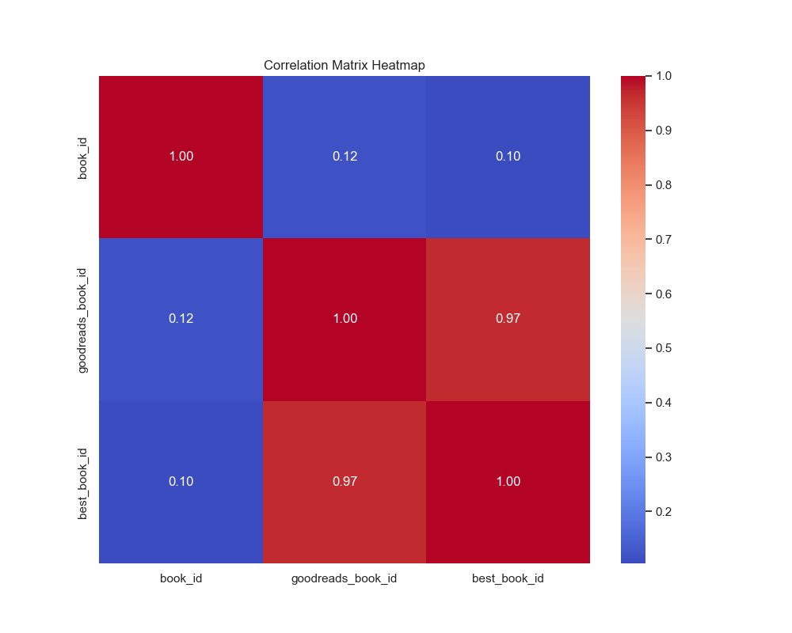
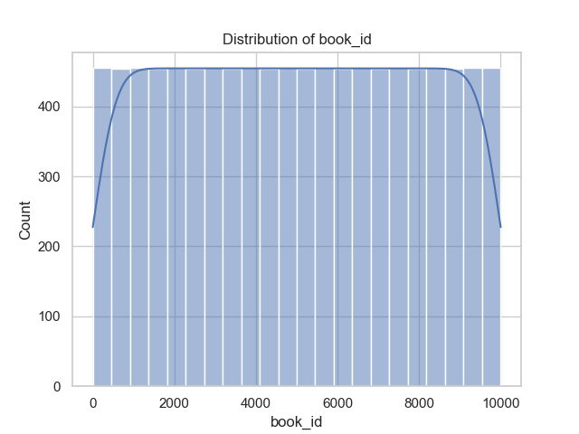
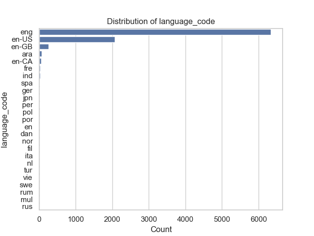

### README File for `goodreads.csv` Analysis

#### 1. Dataset Overview
The `goodreads.csv` dataset consists of **10,000 rows** and **23 columns**. Each entry in the dataset provides detailed information about different books available on Goodreads. The primary columns include identifiers for the books, metadata regarding the titles, author information, publication years, ratings, and reviews. Below is a structured overview of the dataset:

- **Identifiers**:
  - `book_id`, `goodreads_book_id`, `best_book_id`, `work_id`: Unique identifiers for books and works.
  
- **Metadata**:
  - `books_count`: The number of editions of the book on Goodreads.
  - `isbn`, `isbn13`: Standard identifiers for books.
  - `authors`: The authors of the books.
  - `original_publication_year`: The year the book was originally published.
  - `original_title` & `title`: The original and the Goodreads title of the book.
  - `language_code`: Language in which the book is written.

- **Ratings and Reviews**:
  - `average_rating`: The average rating of the book.
  - `ratings_count`: The number of ratings the book has received.
  - `work_ratings_count`: The number of ratings for the specific work.
  - `work_text_reviews_count`: The total number of text reviews.
  - `ratings_1` to `ratings_5`: Breakdown of the number of ratings across the five-star rating system.

- **Media**:
  - `image_url` and `small_image_url`: Links to the book's cover images.

#### 2. Performed Analysis and Significance
The analysis involved a comprehensive examination of the dataset's structure, summary statistics, missing values, correlation insights, and outlier detection. Key components included:

- **Summary Statistics**: Analyzed numerical features to understand their distribution, central tendency (mean, median), and dispersion (standard deviation, min/max).
  
- **Missing Values**: Identified missing entries across various fields highlighting areas that require data cleaning or attention.

- **Correlation Insights**: Analyzed relationships between numerical attributes to uncover trends�for instance, the correlation between `average_rating` and `ratings_count`, which revealed how the volume of ratings influences perceptions of quality.

- **Outliers**: Detected potential outliers across several attributes, which may indicate data integrity issues or notable anomalies in book ratings or counts.

#### 3. Insights Uncovered
Several significant insights emerged from the analysis:

- **Missing Data**: Notable missing values were found in various attributes, such as `isbn`, `original_publication_year`, and `language_code`. This suggests potential gaps in data collection that could affect analyses focused on publication trends or linguistic diversity in literature.

- **Average Rating Trends**: The analysis indicates a mean average rating of **4.00**, suggesting a generally positive reception of books in this dataset. The high ratings count correlates strongly with `work_ratings_count`, pointing to a consistent relationship between the number of readers engaging with a book and its perceived quality.

- **Publication Timeline**: The `original_publication_year` ranges dramatically, indicating a wide variety of publications; however, it also displays intriguing trends, such as a notable increase in books published post-2000, which may reflect growing readership or emerging genres.

- **Outlier Detection**: A high degree of outliers in ratings indicates either extreme performances (both negative and positive) in specific titles, meriting further exploration to understand factors contributing to such divergent ratings.

#### 4. Recommendations for Future Exploration
To leverage the insights from this analysis and derive actionable outcomes:

- **Data Cleaning**: Address missing values by either imputing data or excluding incomplete records to prepare for more robust analytics.
  
- **Genre Analysis**: Investigate if certain genres yield higher ratings or reviews to guide potential marketing strategies or editorial decisions.

- **Temporal Trends**: Analyze trends in publication years in combination with their ratings to understand shifts in reader preferences over time.

- **User Engagement Metrics**: Study the relationship between `work_text_reviews_count` and average ratings to assess how extensive engagement from readers influences a book�s overall perception.

#### Conclusion
This analysis of the `goodreads.csv` dataset provides a detailed look into how books are rated, the diversity of authors and titles, and the overall trends in reader engagement. By addressing missing data and understanding the correlation among features, further insights can be harnessed for better decision-making in publishing and marketing strategies. Importantly, the discovered anomalies and the healthy average ratings present opportunities for targeted improvements and strategic planning in the literary domain.

---

This README is structured to provide a comprehensive overview of the dataset, the methodologies of analysis undertaken, the discoveries made, and strategic recommendations for future investigations.

## Visualizations

## Correlation Matrix Heatmap

This heatmap visualizes the relationships between numeric features in the dataset.

## Distribution of book_id

This histogram shows the distribution of the numeric column 'book_id', providing insights into its spread and frequency.

## Distribution of language_code

This bar chart shows the distribution of the categorical column 'language_code', highlighting the frequency of each category.

