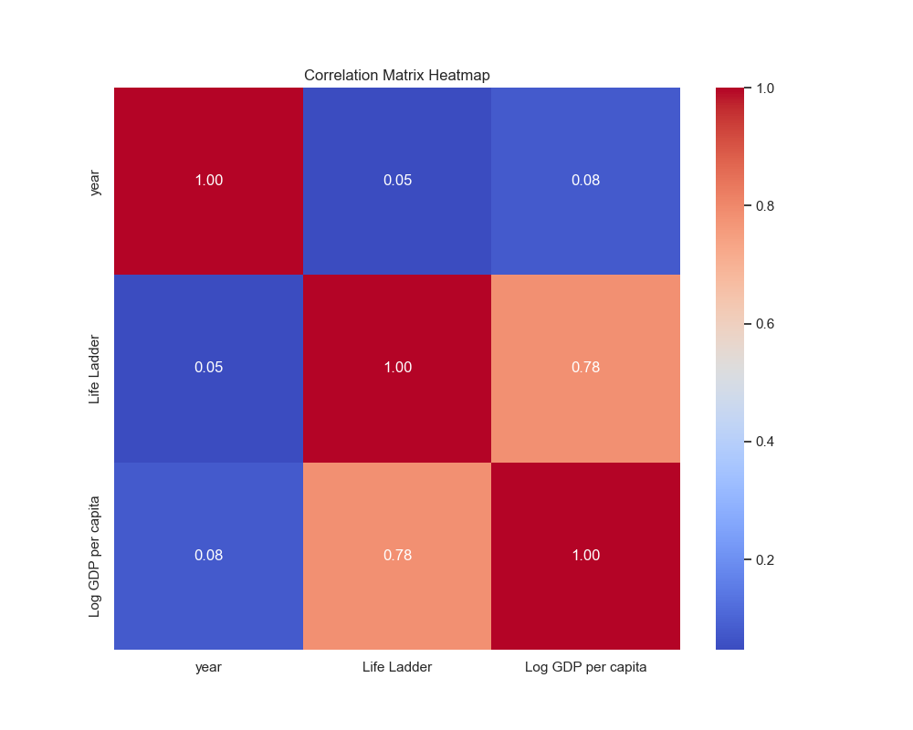
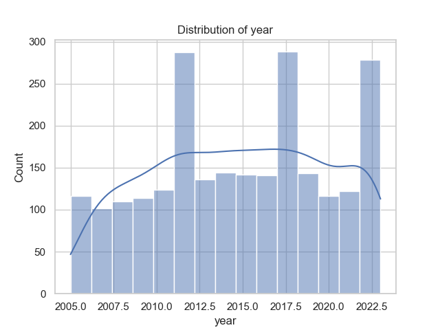
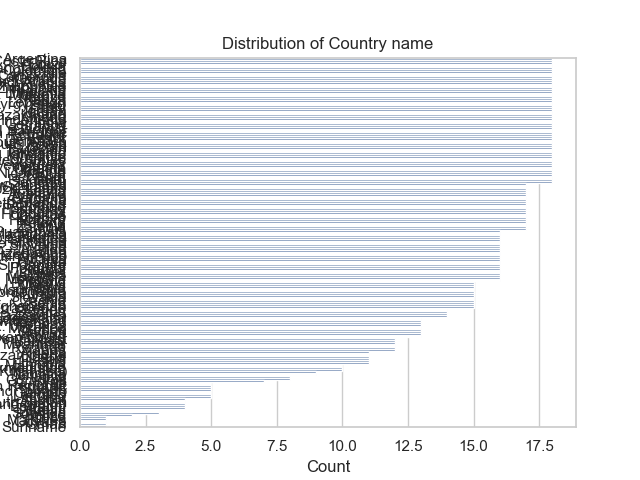

## ReadMe File for Happiness Dataset Analysis

### 1. Dataset Overview

**File Name:** happiness.csv  
**Number of Rows:** 2363  
**Number of Columns:** 11  

**Column Breakdown:**
- **Country name** (dtype: object): Lists the country for each entry, with 165 unique countries represented.
- **year** (dtype: int64): Indicates the year of the data point, ranging from 2005 to 2023.
- **Life Ladder** (dtype: float64): A numerical representation of self-reported happiness, where higher values indicate greater happiness on a scale from 0 to 10.
- **Log GDP per capita** (dtype: float64): The natural logarithm of GDP per capita, serving as a proxy for economic prosperity.
- **Social support** (dtype: float64): Measures the perceived social support available to individuals, with values from 0 to 1.
- **Healthy life expectancy at birth** (dtype: float64): Represents the average number of years a newborn is expected to live in good health.
- **Freedom to make life choices** (dtype: float64): Reflects the degree of personal freedom one feels to make life choices.
- **Generosity** (dtype: float64): Captures the generosity level of a nation, based on donations and volunteerism.
- **Perceptions of corruption** (dtype: float64): Indicates the population's perception of corruption in their country, on a scale from 0 to 1.
- **Positive affect** (dtype: float64): Measures positive emotions felt by individuals in the nations, ranging from 0 to 1.
- **Negative affect** (dtype: float64): Measures negative emotions, also on a scale from 0 to 1.

### 2. Analysis Insights

#### Summary Statistics:
From the summary statistics, the data showcases various aspects of happiness metrics across countries over the years. The mean **Life Ladder** score is approximately 5.48, showing that the average self-reported happiness is between neutral and moderately happy. Notably, **Log GDP per capita** and **Social support** also appear to be influential factors, with means of 9.4 and 0.81, respectively.

#### Missing Values:
Some variables contained missing values:
- **Log GDP per capita**: Missing values in 28 entries.
- **Generosity**: Missing in 81 of the cases.
- **Perceptions of corruption**: Missing values found in 125 entries.

Understanding the extent and impact of these missing values is crucial for data cleanliness and reliability in analysis.

#### Correlation Insights:
The analysis of correlations reveals significant relationships among some variables:
- **Life Ladder** has a positive correlation with **Log GDP per capita** (0.78) and **Social support** (0.72).
- **Freedom to make life choices** is also positively correlated with **Life Ladder** (0.54), indicating that greater freedom may lead to higher happiness levels.
- Interestingly, **Perceptions of corruption** is negatively correlated with **Life Ladder** (-0.43), underscoring the detrimental effect that perceived corruption may have on happiness.

#### Outliers Detected:
The analysis identified several outliers across multiple variables, notably:
- **Social support** exhibited 48 outliers, which may require deeper investigation to gauge the context behind these anomalies.
- The **Perceptions of corruption** also had a considerable number of outliers (194), which might skew results and affect overall conclusions.

### 3. Recommendations for Further Exploration

1. **Data Imputation for Missing Values**: Implement techniques such as mean/mode imputation or advanced methods like K-nearest neighbors to retain data integrity and minimize bias.
  
2. **Segmentation Analysis**: Conduct analyses based on groups such as regions or income levels to discern localized patterns and effects of socio-economic factors on happiness.

3. **Temporal Analysis**: Explore how happiness metrics have changed over the years, particularly before and after irrefutable global events (e.g., financial crises).

4. **Advanced Regression Analysis**: Build models to quantify the relationships among happiness factors while controlling for confounding variables, thus addressing causality over mere correlation.

5. **Surveys and Qualitative Data**: Combine qualitative data through surveys to understand the stories behind quantitative metrics for a holistic view.

### 4. Conclusion

This analysis of the happiness dataset highlighted meaningful insights into the factors influencing happiness globally. The significant correlations among happiness, economic status, and social support illustrate the complexities of well-being. Although the dataset shows promising correlations, missing values and outliers necessitate careful handling to preserve the reliability of analyses that might inform policymakers or non-profit organizations aiming to improve their local communities. The recommended steps will facilitate a deeper understanding and assist in driving actionable insights from this rich dataset.

--- 

By detailing the data structure, analytic insights, recommendations, and concluding remarks, this document serves as a comprehensive guide for stakeholders interested in harnessing data for societal improvement through informed decision-making.

## Visualizations

## Correlation Matrix Heatmap

This heatmap visualizes the relationships between numeric features in the dataset.

## Distribution of year

This histogram shows the distribution of the numeric column 'year', providing insights into its spread and frequency.

## Distribution of Country name

This bar chart shows the distribution of the categorical column 'Country name', highlighting the frequency of each category.

