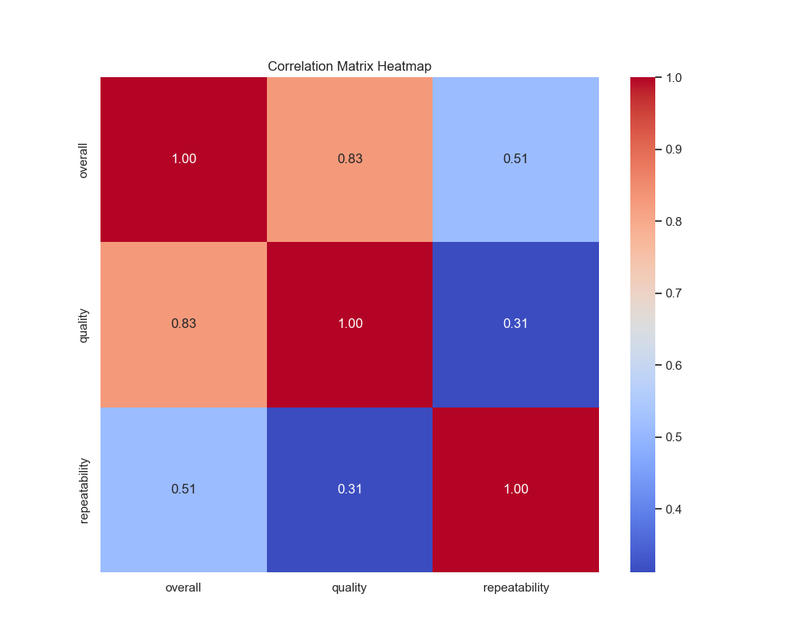
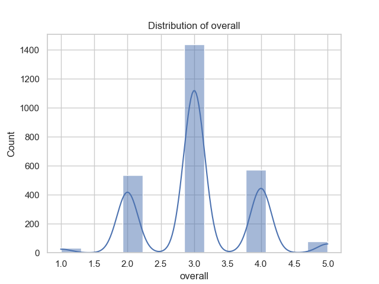
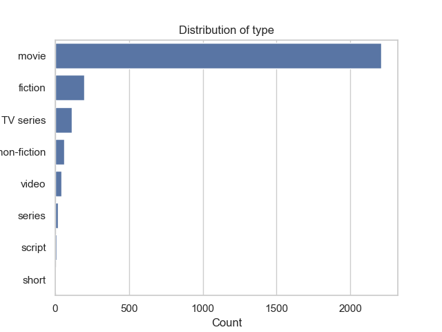

# Media Dataset Analysis Report

## 1. Dataset Structure and Key Characteristics

The dataset named **media.csv** consists of **2,652 entries** and **8 columns**, with each column providing specific attributes of media titles, predominantly movies. Here's a breakdown of the columns:

- **date (object)**: Representing the release date of the media in the format 'DD-MMM-YY'. The column contains a total of **2,553 non-null entries**, with **99 missing values**.
  
- **language (object)**: Indicates the language of the media title, with **11 unique languages** represented. Notably, **Tamil** is the most prevalent language with **1,306 instances**.

- **type (object)**: This column records the type of media. In this dataset, the entries are predominantly categorized as **'movie'**.

- **title (object)**: Comprising **2,312 unique movie titles**, this column captures the distinct names of each media piece.

- **by (object)**: Lists the actors or contributors associated with the media, reporting **1,528 distinct combinations** but exhibiting **262 missing values**.

- **overall (int64)**: This numerical column presents an overall rating for each media title on a scale of 1 to 5. The mean rating is approximately **3.05** with a standard deviation of **0.76**, suggesting a relatively moderate reception among the media entries.

- **quality (int64)**: Similar to 'overall,' this represents a quality rating, also on a scale of 1 to 5, with a mean of **3.21**.

- **repeatability (int64)**: This column possibly indicates the frequency of media being revisited or rewatched, with ratings primarily at the lower end (mean = **1.49**).

## 2. Analysis Performed and Its Significance

The analysis undertaken focuses on uncovering significant statistics, correlation relationships, outlier detection, and missing value insights. The significance of these analyses is to derive actionable insights for stakeholders such as media analysts, producers, or marketers by offering comprehensive visibility over media performance trends and movie characteristics.

### Key Analytical Findings:
- **Summary Statistics**: The summary statistics indicate a distributional trend within the ratings, suggesting that most media titles are perceived as moderate in terms of quality and overall entertainment value.

- **Missing Values**: The analysis highlights missing values in the **date** and **by** columns. Understanding the implications of these missing entries is critical for ensuring data completeness in future modeling or recommendations.

- **Correlation Insights**: The correlation matrix reveals strong positive relationships:
  - **Overall and Quality Ratings (0.83)**: This high correlation indicates that titles rated positively overall tend to exhibit high quality ratings as well.
  - **Overall and Repeatability (0.51)**: Suggesting a moderate connection between high ratings and the likelihood of rewatching titles.

- **Outliers Detected**: Significant outliers were identified in the **overall** ratings, potentially indicating either unusually high or low ratings that warrant further investigation for pattern recognition.

## 3. Actionable Next Steps for Further Exploration

To leverage the insights gathered and enhance decision-making, the following steps are recommended:

1. **Data Cleaning**: Addressing the missing values, especially in the **date** and **by** columns, should be prioritized to improve dataset completeness.

2. **Deep Dive into Outliers**: Conduct a thorough examination of the outlier entries in the overall ratings to understand the context of these ratings, which could inform marketing strategies or content creation.

3. **Trend Analysis by Genre or Language**: Exploring the dataset by grouping certain characteristics (such as language or actor combinations) could reveal nuances in consumer preferences and help tailor marketing efforts for specific demographics.

4. **Audience Feedback Integration**: If available, integrating user-generated reviews or ratings could provide additional valuable context, augmenting current rating systems with qualitative insights.

5. **Temporal Analysis**: Analyzing trends over time, especially with the dates provided, could yield insights on how media reception evolves and inform future media projections.

## 4. Conclusion

The analysis of the **media.csv** dataset reveals several insights into the landscape of media ratings, highlighting key correlations, existing data gaps, and areas for further exploration. The data indicates that while many media titles receive moderate ratings overall and in terms of quality, notable outliers and trends can provide valuable guidance for stakeholders. By addressing the identified missing values and focusing on consumer preferences through deeper qualitative and temporal insights, stakeholders can make informed decisions that resonate with their audience's interests.

---

**Readme File Overview:**

To complement the dataset analysis, a robust readme file will cover:

- **Dataset Description**: An explanation of the dataset's purpose, source, and content.
- **Detailed Column Meanings**: A description of each column, including data types, unique values, and examples.
- **Analysis Insights and Significance**: A summary of key statistics, correlation insights, and the importance of each finding.
- **Next Steps**: Recommendations for further analysis and potential enhancements to data usage.
- **Conclusion**: A wrap-up of the analysis, encapsulating the main findings and implications.

This readme file will serve as a professional and comprehensive guide to understanding and utilizing the insights obtained from the media dataset analysis.

## Visualizations

## Correlation Matrix Heatmap

This heatmap visualizes the relationships between numeric features in the dataset.

## Distribution of overall

This histogram shows the distribution of the numeric column 'overall', providing insights into its spread and frequency.

## Distribution of type

This bar chart shows the distribution of the categorical column 'type', highlighting the frequency of each category.

